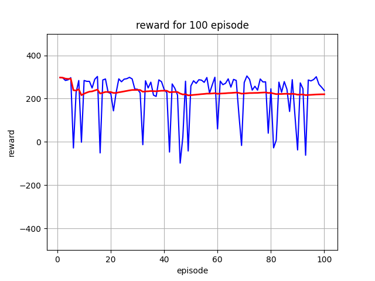
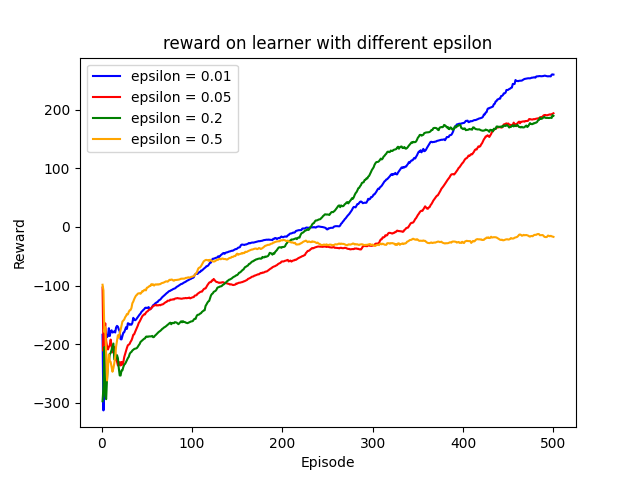
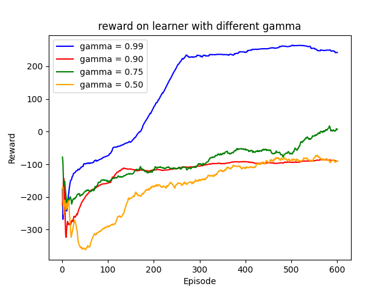

# Lunar Lander Reinforcement Learning Agent

This project implements and trains an agent to successfully land the "Lunar Lander" (LunarLander-v2) environment in OpenAI Gym. The goal of this project is to demonstrate the application of reinforcement learning techniques to solve a challenging control problem.

## Project Description

The Lunar Lander environment is an 8-dimensional state space problem with six continuous state variables and two discrete ones. The action space is discrete with four possible actions:
1. Do nothing
2. Fire the left orientation engine
3. Fire the main engine
4. Fire the right orientation engine

The objective is to land the lunar lander safely on the landing pad at coordinates (0,0) by controlling the engines.

## Implementation

### Agent Design
For this project, we implemented several reinforcement learning agents, including:
- DQN (Deep Q-Network)
- DDQN (Double Deep Q-Network)
- Dueling DQN

### State Representation
The state at each time step is represented as an 8-tuple:
- `x, y`: Horizontal and vertical position
- `ẋ, ẏ`: Horizontal and vertical speed
- `θ, θ̇`: Angle and angular speed
- `legL, legR`: Binary values indicating whether the left or right leg is touching the ground

### Reward Structure
The reward structure is designed to encourage safe landing and penalize crashes or excessive engine usage:
- +100 points for a safe landing
- -100 points for a crash
- +10 points for each leg-ground contact
- -0.3 points for firing the main engine
- -0.03 points for firing the orientation engines

### Training and Evaluation
The agents were trained using the following hyperparameters:
- Learning rate
- Discount factor
- Exploration rate

Graphs were generated to demonstrate:
- The reward for each training episode
- The reward per episode for 100 consecutive episodes using the trained agent
- The effect of hyperparameters on the agent's performance

## Results

### Performance

### Hyperparameter Tuning

## How to Run

### Prerequisites
- Python 3.8+
- PyTorch
- OpenAI Gym
- Matplotlib
- numpy
- torch
- box2d

There are 4 different python scripts for this project.
1. p2DDQN.py is the main script that solve the Lunar Lander problem, producing graph of reward on training episodes and testing episodes. It should take 20 minutes to run.
2. p2 DDQN_gamma test.py , p2 DDQN_alpha test.py, p2 DDQN_epsilon test.py are the 3 hyperparameter I choose to conduct sensitivity test to analysize its impact. Each is built based on original p2DDQN.py. It should take about 90 minutes to run.